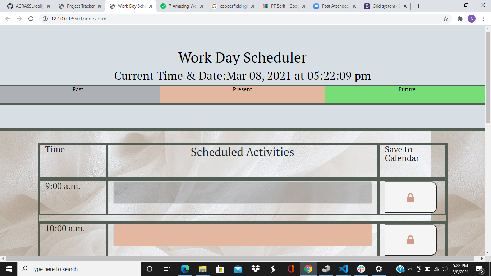
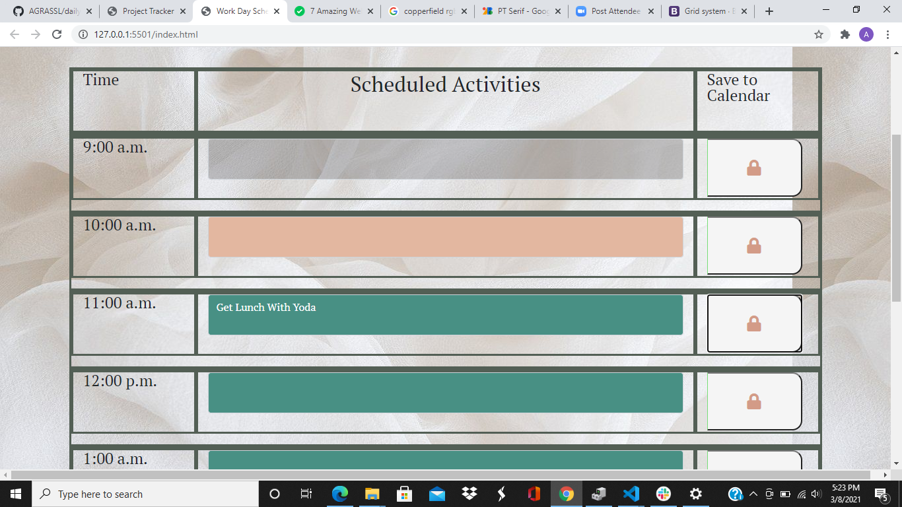

# dailyplanner

# Daily Workday Planner Using 3rd Party APIs

This project was created with the purpose to learn, practice and properly exicute 3rd party APIs including jquery, bootstrap, and moment. Using these 3rd parties made constructing the progam a much more fluid and simple process as well as giving the application the ablility to adjust and change based on the given time. The planner displays a 9:00am-5:00pm work schedule with time slots in insert activites. When the user presses save in their activity, and they refresh the page, the input will save (with the use of local storage) keeping all activites intact. If the time of day is 10:00am for example, the 9:00am slot will turn grey showing that on that day, the time of 9:00-9:59am has passed. The current hour of 10:00-10:59am will appear a red color to show present, and all future slots will be green. The color code chart at the top of the page also shows the corresponding colors to times. 

# Technologies 

This project utilized HTML, CSS, and Javascript languages and the 3rd party APIs of jquery, moment, and bootstrap. The project largly focused on local storage and 3rd party APIs in order for everything to work properly.

# Implementation

When landing on the page the user is able to:

1. See the day and current time at the top of the page:

2. Input and save activities:

3. See if the time of day is past, present, or future:

# Contribute
All contributions are welcome as well as pull requests.

# Credits
Credit goes to Northwestern's Coding Bootcamp instructors for the opportunity to work on this project.

# License
MIT License

Copyright (c) [2021] [Alexandra Grassl]

Permission is hereby granted, free of charge, to any person obtaining a copy
of this software and associated documentation files (the "Software"), to deal
in the Software without restriction, including without limitation the rights
to use, copy, modify, merge, publish, distribute, sublicense, and/or sell
copies of the Software, and to permit persons to whom the Software is
furnished to do so, subject to the following conditions:

The above copyright notice and this permission notice shall be included in all
copies or substantial portions of the Software.

THE SOFTWARE IS PROVIDED "AS IS", WITHOUT WARRANTY OF ANY KIND, EXPRESS OR
IMPLIED, INCLUDING BUT NOT LIMITED TO THE WARRANTIES OF MERCHANTABILITY,
FITNESS FOR A PARTICULAR PURPOSE AND NONINFRINGEMENT. IN NO EVENT SHALL THE
AUTHORS OR COPYRIGHT HOLDERS BE LIABLE FOR ANY CLAIM, DAMAGES OR OTHER
LIABILITY, WHETHER IN AN ACTION OF CONTRACT, TORT OR OTHERWISE, ARISING FROM,
OUT OF OR IN CONNECTION WITH THE SOFTWARE OR THE USE OR OTHER DEALINGS IN THE
SOFTWARE.
